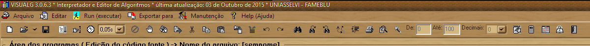
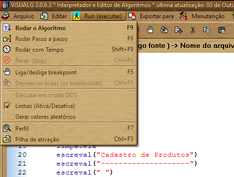
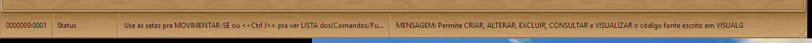
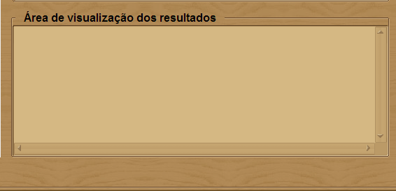
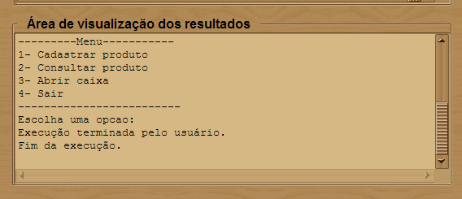
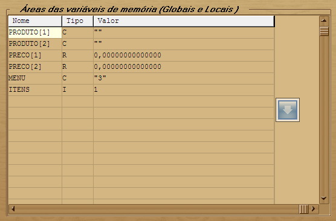

O VisuAlg não é uma linguagem de programação, mas uma ferramenta que auxilia no aprendizado da linguagem Portugol, VisuAlg tem algumas peculiaridades, que torna esta versão do Portugol proprietário e mais adequado ao uso com sua Interface. Isso não é um problema paranós, já que o aprendizado desta versão do Portugal tem como objetivo o desenvolvimento denossa capacidade de pensar de forma estruturada, e não usaremos esta linguagem por muito tempo, é apenas um estágio em nosso parendizado.

A partir deste ponto chamaremos a Ferramenta ou Interface do VisuAlg de **IDE** (Integrated Development Environment) em português *Ambiente de Desenvolvimento Integrado*, um software que possui todas ferramentas e viabiliza a interação com outras ferramentas de desenvolvimento de forma totalmente integrada e transparente.

Com o uso de uma IDE, não precisamos nos preocupar com o editor usado para escrever nosso código, nem com a página de codificação dos caracteres adota, não precisamos nos preocupar com a ferramenta usada para nos ajudar a encontrar erros de escritas, muito menos com a ferramenta usada para converter nosso código em um formato mais próximo para o entendimento do computador, e muito menos com a fase final de ligação do nosso código com as instruções e posições de computador que se destina o código.

A IDE é responsável por ter todas as ferramentas que precisamos, totalmente integradas e totalmente de forma transparente.

Abaixo apresentamos a tela inicial do VisuAlg:


Como pode ser visto a janela é dividida em 3 seções muito importantes:
* Área de programa
* Áreas das Váriáveis de Mémoria
* Área de Visualização de Resultados

Além destas 3 seções, temos também o "Menu" no topo da tela, logo abaixo "Barra de Ferramentas" e na base ou roda-pé da janela principal temos a "Barra de Estatus".

Teremos também uma janela secundária que sempre se abre quando executamos nosso algoritmo que representa o programa quando executado, chamaremos de "Console".

vejamos alguns detalhes de cada um deles.

## Menu
Como todo software para sistemas operacionais baseados em janela como Windows, MAC ou Linux Gráfico com base em XWindows ou X86, é comum ter um menu que nos dá acesso a ações, agrupados conforme funcionalidades

Abaixo vemos o menu do VisuAlg Versão 3.0:



Os dois primeiros menus não há muita novidade, apenas o comum em qualquer editor de texto, no Menu "Arquivo" iremos encontrar ações referentes a abrir, salvar e fechar arquivo, além de fechar o IDE, no menu "Editar" ações relacionadas a edção como copiar, colar, recortar, pesquisar no código por strings de texto.

>**String** de texto, é uma sequência de letras, caracteres, quando formos estudar estar tipos de dados, entenderemos melhor este conceito.

Já o menu "Run (Executar)" é novidade para muitos, com ele iremos testar nosso algoritmo solicitando ao VisuAlg que prepare nosso algoritmo para execução, verificando erros e executando sequêncialmente, ou se desejarmos passo a passo com nosso total controle.

Veremos em detalhes o uso de cada opção do menu durante as praticas de aula, em especial "Executar Algoritmo" e "Executar Passo a Passo".

Não deixe de estudar este menu, e práticar o uso das teclas de atalho, indicadas a direita de cada opção, a que mais usaremos é [CTRL]+[S] para salvar e [F9] para executar nosso código e [F8] para executar nosso código passo a passo.

> O que estas letras entre "colchetes"? usamos esta representação para indicar teclas a serem usadas como atalhos, no caso de [CTRL]+[S] representa o uso em sequencia combinada das teclas "Control" e a tecla "s", ou seja, devem ser precionadas em conjunto, sempre na sequência sugerida, assim se aperta a tecla "Control", mantem, e em conjunto aperta a tecla "s", soltando logo em seguida, observe que mesmo estando representada em maiúscula **não** usaremos a tecla "Shift" muito menos a tecla "Caps Lock" para deixar em maiúscula.

## Menu Run (Executar)
Vamos dar uma atenção especial ao menu **Run (Executar**, sem dúvida ele é o menu mais utilizado em uma IDE, com ele testamos nosso código e corrigimos os erros que possam existir.



Aproveitando o momento, como dissemos a direita de cada opção do menu, a interface do VisuAlg nos informa qual é a tecla de atalho para acelerar o acesso a esta opção.

Neste menu encontramos duas ações muito imoprtante para testarmos nosso algoritmo, a primeira mais comum, é "*Rodar o Algoritmo*", pode ser acessada simplesmente teclando **[F9]**, esta opção executa o programa sem nenhum tipo de interrupção (a não ser que haja um ponto de parada para depuração de código, vermos mais a frente), ou  as programadas pela propria linguagem Portugal, atraves de comandos como "```Leia()```" ou ```pausa```.

**OBS.:** Quando a execução de algortimo encontra o comando ```pause``` ele irá aguardar até que você tecle [F(] ou [F8] para continuar a execução. Não use ```pause``` para substituir pontos de parada (Break Points) para depuração.

Já a ação "Rodar Passo a passo" também acessada através da tecla [F8], irá executar seu programa linha por linha, cada linha é executada a cada vez que [F8] é apertado. 

### Como ir direto a uma linha de execução e parar

Há outras opções muito interessantes, por exemplo "Liga/Desliga breakpoint" também disponível pela tecla de atalho [F5] permite que marque a linha selecionada para que seja um ponto de parada para diagnostico, assim ao executar seu programama através de [F8] ("Rodar o Algoritmo") ele irá executar até esta linha e irá parar aguardando que mande continuar através de [F9] ou passo através de [F8], assim você pode dar um grande sauto entre muitas instruções e parar exatamente no local onde seu algorritimo parece não funcionar bem.

Para desmarcar um breakpoint vá na linha onde ele foi imposto (linha marcada na cor vermelha) e tecle novamente [F5].

### Meu algoritmo tomou vida propria e não quer parar
Para interromper seu algoritimo seja porque motivo for, em especial devido a um mal funcionamento, você pode usar a combinação de teclas [CTRL]+[F2] durante sua execução, seja continua, ou passo a passo.

Esta opção apenas está disponível quando o algortimo está em execução.


#Barra de Ferramentas
Nossa barra de ferramentas é um atalho as ações disponíveis no menu, ali se encontra as ações da IDE mais utilizada e estão representadas por icones para facilitar seu uso, veja na imagem abaixo ela está logo abaixo do menu:


Bem não precisamos entrar em detalhes, sobre o uso da barra, durante nossas práticas em aula iremos entede-la.

#Barra de Estatus
A barra de estatus, ou se preferir barra de status, apresenta informações relevantes ao programador durante a codificação.



Na barra do VisuAlg temos uma pequena seção que nos mostra a a linha e coluna onde se encontra o curso, informação muito útil para encontrarmos o curso e também formatarmos nosso código. 

Na proxima seção da barra de estatus, vemos o estado do documento, se vazio ele está salvo, se modificado tem a indicação "Modificado", se em pesquisa a indicação "Pesquisando", com o uso da ferramenta irá identificar novos "Status" para seu domento.

Na proxima seção vem um texto que instrui como melhor usar as teclas na seção ativa, e finalmetne a ultima seção que apresenta mensagens relevantes sobre os processos solicitados, por exemplo coloque o mouse sobre cada seção da janela, e veja a mesangem apresentada. Você verá que ele lhe apresenta a seção e como elapode ser útil para você.

## Seção Visualização de Resultados
A Seção de visualização de resultados apresenta mensagens relativas a execução do programa, mantendo um histórico da execução, principalmente inicio e fim, é preciso cuidado pois espera-se que a interação seja pelo console, masno Visuag a intarção ocorre um pouco diferente, sendo do nesta etela apresentada as mensagens do programa, e em janelas especificas as solicitações de dados ao usuário, a console será vista mais a frente..



A seguir veja a seção "Área de visualização dos resultados", apos executarmos um simples algortimo conceitual que sugere o funcionamento de um sistema de caixa.




## Seção das Variáveis de Memória
Nesta seção é possível ver o conteúdo de cada variável de mémoria Global ou Local (entederemos isso mais a frente).
Veja abaixo como esta seção fica ao usarmos o Algoritmo "Caixa".



Esta seção possui 3 colunas, a primeira contem o nome das variáveis, cada variável em uma linha, a segunda coluna o Tipo de variável (C = Caracter, R = Real, I = Inteiro, Etc). Na terceira coluna o valor que se encontra no exato momento na variável.

Veja que esta caixa durante a execução de seu algortimo tem os valores em contante mudança, e quando seu sistema termina a execução ela guarda os ultimos valores utilizados. Isso é muito util para depurar (buscar defeitos, bugs) em sua aplicação.


