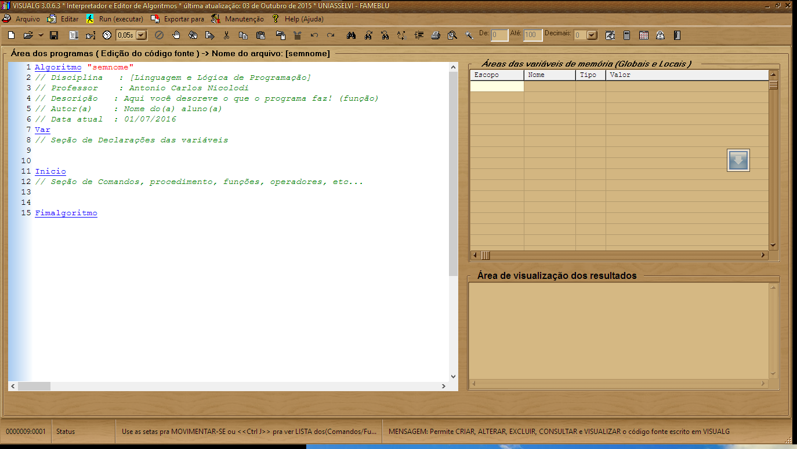

# Capítulo 2 - VisuAlg e sua IDE
O VisuAlg não é uma linguagem de programação, mas uma ferramenta que auxilia no aprendizado da linguagem Portugol, VisuAlg tem algumas peculiaridades, que torna seu Portugol, mas adequado ao uso com sua Interface, o que chamaremos deste ponto em diante de IDE (Integrated Development Environment) em português Ambiente de Desenvolvimento Integrado, um software que possui todas ferramentas ou viabiliza a interação com outras ferramentas de desenvolvimento de forma totalmente integrada e transparente.

Com o uso de uma IDE não precisamos nos preocupar com o editor usado para escrever nosso código, não precisamos nos preocupar com a ferramenta usada para nos ajudar a encontrar erros de escritas, muito menos com a ferramenta usada para converter nosso código em um formato mais próximo para o entendimento do computador, e muito menos com a fase final de ligação do nosso código com as instruções e posições de computador que se destina o código.

A IDE é responsável por ter todas as ferramentas que precisamos, totalmente integradas e totalmente de forma transparente.

Abaixo apresentamos a tela inicial do VisuAlg:

