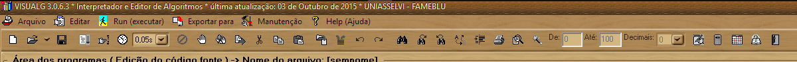

# Capítulo 2 - VisuAlg e sua IDE
O VisuAlg não é uma linguagem de programação, mas uma ferramenta que auxilia no aprendizado da linguagem Portugol, VisuAlg tem algumas peculiaridades, que torna seu Portugol, mas adequado ao uso com sua Interface, o que chamaremos deste ponto em diante de IDE (Integrated Development Environment) em português Ambiente de Desenvolvimento Integrado, um software que possui todas ferramentas ou viabiliza a interação com outras ferramentas de desenvolvimento de forma totalmente integrada e transparente.

Com o uso de uma IDE não precisamos nos preocupar com o editor usado para escrever nosso código, não precisamos nos preocupar com a ferramenta usada para nos ajudar a encontrar erros de escritas, muito menos com a ferramenta usada para converter nosso código em um formato mais próximo para o entendimento do computador, e muito menos com a fase final de ligação do nosso código com as instruções e posições de computador que se destina o código.

A IDE é responsável por ter todas as ferramentas que precisamos, totalmente integradas e totalmente de forma transparente.

Abaixo apresentamos a tela inicial do VisuAlg:

Como pode ser visto a janela é dividida em 3 seções muito importantes:
* Área de programa
* Áreas das Váriáveis de Mémoria
* Área de Visualização de Resultados

Além destas 3 seções, temos também o "Menu", "Barra de Ferramentas" e a "Barra de estatus", o "Menu" no topo da tela, logo abaixo "Barra de Ferramentas" e na base ou roda-pé da janela principal temos a "Barra de Estatus".

Teremos também uma janela secundária que sempre se abre quando executamos nosso algoritmo para que haja interação do usuário com o programa quando executado, chamaremos de "Console".

A seguir veremos o menu e as barras, cada seção e por último a conole como usa-los para termos o melhor resultado.

## Menu
Como todo software para sistemas operacionais baseados em janela como Windows, MAC ou Linux Gráfico com base em XWindows ou X86, é comum ter um menu que nos dá acesso a ações, agrupados conforme funcionalidades

Abaixo vemos nosso menu do VisuAlg Versão 3.0:

