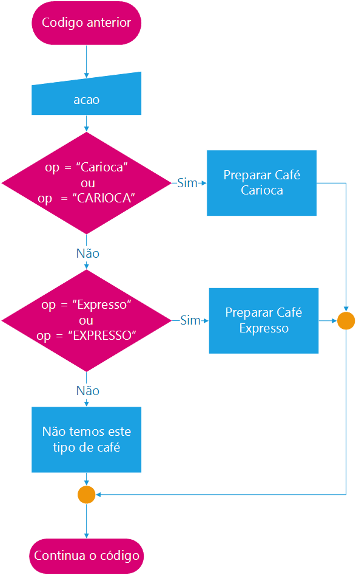

Agora nosso estudo vai começar a ficar mais divertido, e não é porque estamos em um curso técnico que não podemos nos divertir com nosso trabalho.

Passaremos agora a ter maior controle sobre o algoritmo, é aprenderemos a fazer com que o computador faça exatamente o que queremos, conforme dados forem fornecidos a ele. Este aprendizado é muito importante e será usado ao longo de toda a sua vida como desenvolvedor de softwares e firmwares (código para microcontroladores e hardware).

## Operadores Lógicos e Relacionais
Iremos antes de tudo aprender o que são operadores lógicos e relacionais, assim poderemos usa-los com facilidade com as instruções de controle.

mas antes de continuarmos, precisamos conhecer duas constantes muito importantes:

* `VERDADEIRO`
* `FALSO`

São auto descritiveis e podem ser usadas para auxiliar na composição de expressões lógicas em instruções de controle de fluxo (execução de blocos) e instruções de controle de laço.

### Operadores Relacionais 

| Operador | descrição      |  Teste  | Resultado   |
|    --    |     --         |    --   |     --      |
|    =     | Igual          | 2  = 2  | verdadeiro  |
|          |                | 1  = 5  | falso       |
|   <>     | Diferente      | 3 <> 3  | falso       |
|          |                | 2 <> 4  | falso       |
|    <     | Menor          | 1  < 5  | verdadeiro  |
|          |                | 3  < 2  | falso       |
|    >     | Maior          | 1  > 5  | falso       |
|          |                | 3  > 2  | verdadeiro  |
|   <=     | menor ou Igual | 2 <= 7  | verdadeiro  |
|          |                | 4 <= 4  | verdadeiro  |
|          |                | 8 <= 3  | falso       |
|   >=     | maior ou Igual | 2 >= 7  | falso       |
|          |                | 4 >= 4  | verdadeiro  |
|          |                | 8 >= 3  | verdadeiro  |

### Operadores Lógicos

| Operador | descrição      |  Teste  | Resultado   |
|    ---   |     ---        |   ---   |    ---      |
| Nao | Operador unário de negação, tem maior precedencia sobre os demais operadores, faz a inversão da lógica, ou seja, verdaeiro se torna falso e falso verdadeiro | nao 2 = 2 | falso |
|  ou | Operador similar a soma binária, quando um dos valores for verdadeiro ou ambos forem, retorna verdadeiro          | verdadeiro ou verdadeiro  | verdadeiro |
|     |                     | falso ou verdadeiro       | verdadeiro |
|     |                     | falso ou falso            | falso |
|  e  | Operador similar a multiplicação binária, apenas quando ambos os valores forem verdadeiro, retorna verdadeiro          | verdadeiro e falso        | falso |
|     |                     | verdadeiro e verdadeiro   | verdadeiro   |
| xou | Operador similar ao `ou`, porém apenas retorna verdadeiro se somente um dos valores forem verdadeiros                 | verdadeiro xou verdadeiro | falso      |
|     |                     | verdadeiro xou falso      | verdadeiro |
|     |                     | falso xou falso           | falso      |


### Controles de Desvios
Iremos ver dois controles de desvios de execução, que nos ajudará a dar mais inteligência ao nosso Algortimo. O primeiro um desvio por decisão com base em expressões lógicas, muito indicado para tomada de decisões, e já deixo aqui um gancho para pesquisas de algortimos avançados como o "C4.5", não veremos tais algortimos em nosso curso, então vamos ao nosso primeiro controle o `se`, em seguida veremos o comando `escolha`, um controle de seleção multipla.

### Se

O comando `se` espera em seguência uma expressão lógica que irá definir "se" executará "então" um bloco de código, seja de apenas uma linha, ou seja de muitas linhas, ou "se não" executará outro bloco.
 
A estrutura padrão do comando é:

```
se m < 7.0 entao
   Escreva ("Em EXAME")
Senao
   Escreva ("APROVADO")
fimse
```

Representamos o exemplo acima com o fluxograma:


No pedaço de algortimo acima, temos o seguinte a ser interpretado: Se "m" menor que o valor real 7.0 então escreva "Em EXAME" na tela, agora se "m" não for menor nem igual, então, escreva "APROVADO" na tela.
 
É possível inserir uma estrutura de decisão dentro da outra, veremos tal prática com exercícios.

### Escolha

o comando `escolha` em algumas situações é melhor que o comando `se`, quando temos uma quantidade de analise de decisão maior, como por exemplo em códigos de menu, ou que receba caracteres como resposta e precisa tomar decisões.

Vejamos um exemplo da estrutura do uso do `escolha`:

```
leia(op) // apenas para auxiliar o entendimento, não faz parte da estrutura de controle
escolha op
   caso "Carioca", "carioca", "CARIOCA"
      escreverl("preparar café carioca")
   caso "Expresso", "expresso", "EXPRESSO"
      escreverl("preparar café expresso")
   outrocaso
      escreverl("não tenho este tipo de café.")
fimescolha
```
O fluxograma para o código acima pode ser desenhado da seguinte forma:



Como podem ver o comando `escolha` permite diversos casos, no **Portugol** do **VisuAlg**, não executam um após outro apartir do escolhido, mas cuidado em outras linguagem como o C/C++ exige um comando de interrupção.

No comando `escolha` também podendo ter uma opção `outrocaso` que será executado caso nenhuma outra opçao seja identificada.

E se mais de uma opção for possível, basta inseri-las separando cada um apor virgula.

### Controles de Laços (loops)

Alguns blocos de código precisam ser executados durante um periodo de tempo ou enquanto uma determianda condição é mantida. Para isso existens três instruções no **Portugol** que nos permitem controlar de forma diferente um bloco de código.

#### Enquanto

A instrução de controle de laços `enquanto`, é usada para permitir a execução de um bloco de instruções finitamente, antes de cada execução do bloco uma condição é analisada, enquanto ela retornar verdadeiro.

Vejamos como é a instrução de forma completa:

```
algoritmo "demonstracao enquanto"
Var
   contador: inteiro

inicio
   continua <- "s"
   contador <- 1
   escreval("Começa?")
   leia(continua) 
   enquanto continua = "s" faca
   
      escreval("Contador: ", contador)
      contador = contador + 1 
      
      escreval("Contitua ou para?")
      leia(continua) 
   fimenquanto
   escreva("Equanto Finalizado:",contador)
fimalgortimo
```


#### Repita
Já a instrução ```repita``` permite o bloco ser executado pelo menos uma vez, antes de verificar se a condição que permite a repetição seja analisada.

```
algoritmo "demonstracao repita"
Var
   contador: inteiro

inicio
   contador <- 1
   escreval("Começando Enquanto:",contador)
   escreval("Contitua ou para?")
   repita 
      escreval(contatodor)
      contador = contador + 1
      leia(continua) 
   ate  continuar = "s"
   escreva("Equanto Finalizado:",contador)
fimenquanto
```

Como pode ver a instrução de controle repita fica no laço até que a opração lógica retorne verdadeiro, ou seja, "repete até que seja verdadeiro".
Podemos dizer assim que o controle de laço repita é a negação do controle de laço enquanto.

Existe uma segunda forma de se usar o controle de laço repita que permite infinitamente executar um bloco de código, em um caso que veremos muito util no mundo dos microcontroladores, e por hora, seria também útil para um sistema que conte com um menu, vejamos como fica o programa acima com este formato, essa nova sintaxe:

```
algoritmo "demonstracao repita infinito"
Var
   contador: inteiro
   continua: caracter

inicio
   contador <- 1
   escreval("Começando Enquanto:",contador)
   escreval("Contitua ou para?")
   repita 
      escreval(contatodor)
      contador = contador + 1
      leia(continua)
      se continua = "parar"
         interrompa
      fimse
   fimrepita
   escreva("Equanto Finalizado:",contador)
fimenquanto
```

Veja, neste caso o uso do interrompa, que será explicado abaixo se torna adequado e necessário.

#### Para
A instrução de controle de laços `para` deve ser usada quando for preciso contadores automático, normalmente para acessar vetores. Vejamos um exemplo com a estrutura completa:

```
algoritmo: "demonstracao para"
Var
   contador: inteiro
   
inicio 
   para contador de 1 ate 10 passo 1 faca
      escreval("Valor: ",contador);
   fimpara
fimalgoritmo
```


Você por exemplo usar o laço ```para``` para informar que o computador está pensando, infelizmente até a versão 3.0 não descobri uma forma de causar um tempo no processamento, portanto para isso faremos dois laços um dentro do outro, assim poderemos induzir o usuário que algo está acontecendo e que leva tempo, lembre-se isso é apenas uma sugestão didática.
 
```
algoritmo: "para ver2"

const 
   TEMPO = 100
Var
 contador: inteiro
 contador2: inteiro

inicio
 escreval("Começando: ")
 para contador de 1 ate 10 passo 1 faca
   escreva(".");
   para contador2 de 1 ate TEMPO faca
     escreva("")
   fimpara
 fimpara
fimalgoritmo
```

No caso de manipulação de vetores, vamos ver como calcular a média de uma determinada leitura de temperatura, por exemplo suponha que você tem um sistema e precisa ler 10 coletas de leituras:

```

algoritmo "para ver3"

const
 leituras = 10

Var
 temps: vetor[1..leituras] de Inteiro
 soma: inteiro
 c: inteiro

inicio
 escreval("Começando, informe de ", leituras, " de temperatura: ")
 para c de 1 ate leituras passo 1 faca
    leia(temps[c])
    soma = soma + temps[c]
 fimpara

 escreval("Foram obtidas as seguintes leituras: ")
 para c de 1 ate leituras passo 1 faca
   escreva(temps[c])
 fimpara
 escreval("")
 escreval("Média da temperatura", soma/leituras)
fimalgoritmo
```


#### Interrompa

Para as três instruções de controle de laço, enquanto, repita e para é possível inserir condições internas se ou caso e assim interromper o laço, chamando o comando Interrompa.

Isso não é indicado para programação estruturada, já que quebramos o fluxo do nosso Algoritmo, tornando o codígo confuso e muito ramificado.
O ideal é que estruture seu código de forma que este flua naturalmente sem o uso do Interrompa então procure buscar melhorias no seu algoritmo, otimizações, e evite o uso do Interrompao máximo que puder.


## Próximos Passos

Não há nada mais importante na vida tecnologica da humanidade quanto a matemática, sem ela nada do que temos hoje teria acontecido. E no próximo passo veremos rápidamente como transformar nosas formulas matemáticas em algoritmos.

---
Revisado: 07/07/2016 - 12:00 | Atualizado: 07/07/2016 - 11:55 | Compilado: {{ gitbook.time }}