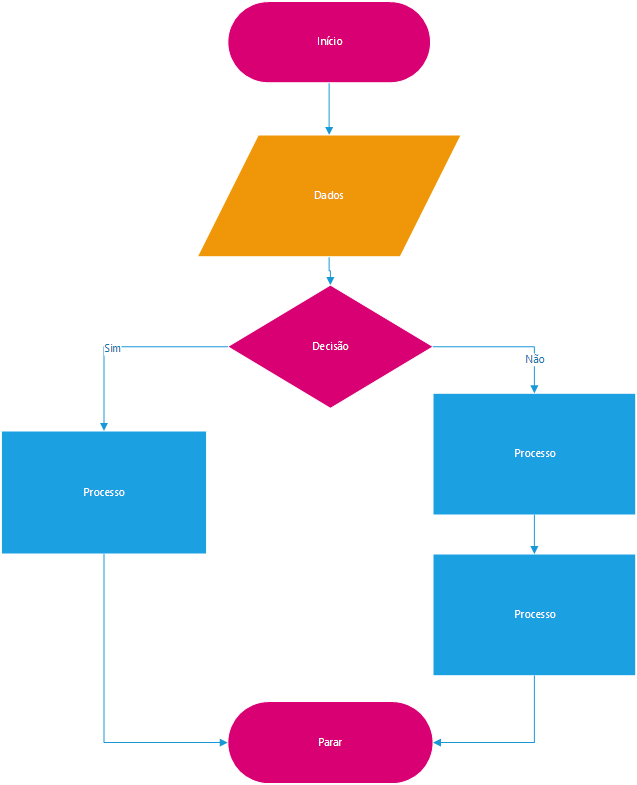

Vamos interromper nossa sequência de estudo no Portugol, para aprender algo muito importante para diagramarmos um Algortimo, e através de representação gráfica demonstrar como apresentar o fluxo de nosso código quando este se torna mais complexo e um texto fica dificil de ser compreendido.

Este formato gráfico, é conhecido como fluxograma.

Abaixo é apresentado os principais simbolos que usararemos para representação gráfica de nosso código em portugol.

