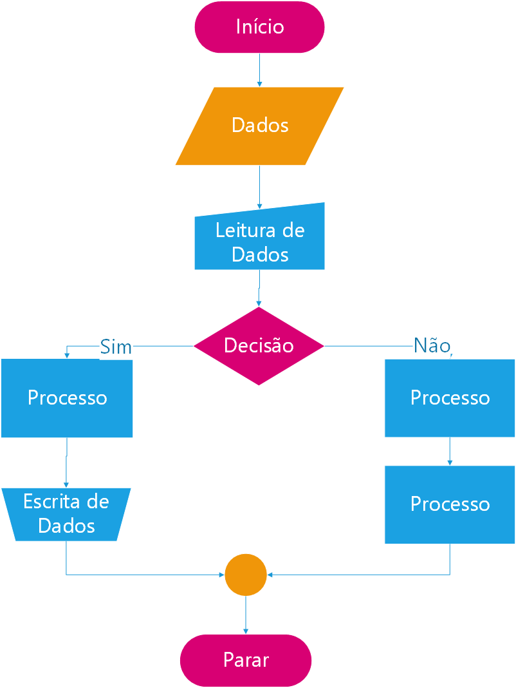

Vamos interromper nossa sequência de estudo no **Portugol**, para aprender algo muito importante para diagramarmos um **Algortimo**, e através de representação gráfica demonstrar como apresentar o fluxo de nosso código quando este se torna mais complexo e um texto fica difícil de ser compreendido.

Este formato gráfico, é conhecido como ***fluxograma***. Para nos ajudar a fazer nossos primeiros fluxogramas e assim nos comunicarmos melhor, iremos usar o software ***Dia***, e [pode ser baixado clicando aqui.](https://drive.google.com/a/carlosdelfino.eti.br/file/d/0B_nY5U9uO3kPeld0TkJQU3NGZGs/view?usp=sharing)

A seguir é apresentado os principais símbolos que usaremos para representação gráfica de nosso código em portugol.

### Início

### Dados

### Leitura de Dados

### Escrita de Dados

### Processar

### Decisão

### Ponto de Junção

### Parar

### Exemplo de uma sequência genérica de Fluxograma

## Próximos Passos (próximo subcapítulo)
Vamos ver agora como controlar a execução de um determinado bloco de código além do principal, veremos os operadores lógicos para que possamos ajudar na tomada de decisão. Após este passo veremos os operadores matemáticos.

---
Atualizado: 09/07/2016 - 16:30 | Revisado: {{ file.mtime }} | Compilado: {{ gitbook.time }}
