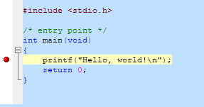

Mesmo nos temos atuais (meados de 2016) onde ferramentas visuais nos permite programar fácilmente para o Arduino usando bloquinhos como se brinca com um quebra cabeça, nós como profissionais precisamos aprender como realmente programar um computador e usarmos uma linguagem, no caso C, que expresse realmente nosso desejo. Sabemos que aluns outros sistemas de grande responsabilidade como por exemplo o Ladder para microcontrolador também usa uma linguagem visual para ajudar a gerir grandes sistemas com complexidade alta, mas sempre acabamos em um determinado momento precisando usar a programação através de um forma textual, para que se torne mais clara e melhor expressa do que o que se pode fazer gráficamente.

Além disso com o crescimento de nosso algoritimo, veremos que manter um diagrama se torna um trabalho cansativo, e ainda é mais fácil manter nosso código através de meios tradicionais como a escrita em uma determinada Linguagem.

Para aprendermos C, precisamos de uma ferramenta similar ao que aprendemos o **Portugol**, algo como o ***VisuAlg***, e descobrimos enão que existe uma ferramenta que leva o nome de seu autor: [PELLEs C](http://pellesc.de), uma ferramenta criada da mesma forma que todas as boas ferramentas foram, um profissional que percebeu uma demanda e foi atrás da solução ideal, não achando ele a desenvolveu.

Porém, Pelles C não é a solução definitiva, haverão no decorrer do nosso amadurecimento como programadores a possiblidade de usarmos outras ferramentas.

### Baixando e Instalando o PELLES C

O procedimento é simples, visite o site http://pellesc.de/index.php?page=download&lang=en, apesar de ser um site alemão está em inglês, o que facilita bastante o entendimento, como pode ver apartir de agora o inglês será nosso segundo idioma.

Escolha a versão 32Bits, que rodará bem em qualquer computador.

Após fazer o Download do Pelles C, execute o arquivo `setup.exe`, e prossiga com a instalação padrão, sem alterar nenhum parametro, seguindo clicando no botão **next**, **next** até o fim.

Agora execute o **Pelles C** a seguir veremos como é nossa interface.

### A Interface

A Interface da IDE Peles C é um pouco diferente da IDE VisuAlg 3.0, quando abrimos a aplicação, é apresetnado a janela, como pode ser visto abaixo, temos por padrão o menu, a barra de tarefas, a área principal que no caso do Pelles C permite a abertura de diversas abas com conteúdos diferentes, sendo a primeira a aba com o nome "Start Page",  muito útil para quem está aprendendo.

Nesta aba, são apresentadas ações mais comuns (Common Actions), Projetos recentemente usados (Recent Projects) e sugestões de links para aprendizado e aperfeiçoamento (Links):

Vamos começar usando o primeiro programa que todo programador C faz quando está dando seus primeiros passos, o **Hello World**, para isso clique no link `hello PPJ`.

Veremos então uma nova aba sendo aberta como abaixo:

Não iremos entrar em detalhes como é a linguagem C agora, vamos apenas nos atentar para a interface de programação e como usa-la.

#### Conhecendo os Menus

Os menus "File" (Arquivo), "Edit" (Editar), são comuns e tem pouca diferença entre outros softwares que lidam com edição de texto, temos também o menu "View" (Visualizar) que nos ajuda a ter acesso a ***Áreas*** da janela que terão informações relevantes aos arquivos e recursos que estamos utilizando em nosso programa.

O menu mais importante para nós agora é o "Project" (Projeto), que nos dá acesso a todas as ações relativas ao nosso código e o projeto que estamos codificiando.

Como podem ver na imagem a seguir, é no menu "Project" que temos acesso as ações de compilação e depuração do programa, no Pelles C as teclas de atalho são diferentes das usadas no VisuAlg.

A Linguagem C é uma linguagem compilada, portanto você tem a opção de gerar um código binário compátivel com o computador no qual pretende executar seu aplicativo, então quando usado a sequencia [CTRL]+[B] seu programa é compilado e gerado um arquivo ***Executável*** do tipo **EXE**, se desejar executar seu programa você deve usar a opção "Eecute \*.EXE", onde o asterisco é o nome de seu projeto, ou a sequencia [CTRL]+[F5], veja que você pode depurar seu projeto usando a tecla [F5]

#### Ativando Breakpoints

E se desejar inserir um "BreakPoint" em seu projeto, deverá parar sobre a linha desejada como ponto de parada, clicar com o botão direito e selecionar "Toggle Breakpoint", outra forma mais rápida para isso é clicar duas vezes ao lado esquerdo da linha na faixa branca, assim irá aparecer o ponto vermelho que indica que a linha está marcada para depuração. Para desativar siga os mesmo passos sobre a linha que já tem "BreakPoint".

Abaixo vemos a linha com o breakpoint ativo:

## Próximos Passos

Veremos agora a estrutura básica de um programa em C, apenas o que é importante para entendermos como ter sucesso no Hello World, o que já são dois novos conceitos além do que já aprendemos agora, porém na ótica da linguagem C.

---

Revisado: {{ file.mtime }} | Compilado: {{ gitbook.time }}
