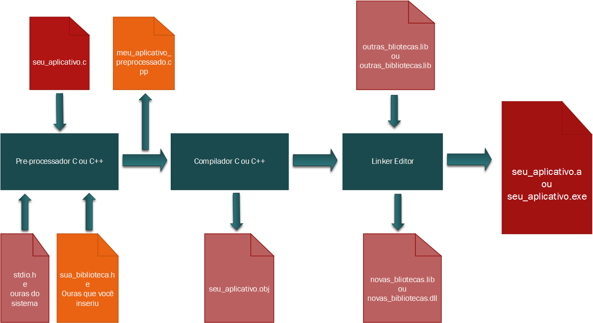

Como já discutimos o Portugol é interpretado, um programa especialmente escrito para esta linguagem perga o arquivo onde está o código escrito por você e o interpreta em tempo de execução, identificando erros de escrita, e procedendo na ordem que lhe é sugerida pelos comandos.

No C algo muito diferente ocorre com seu código escrito, vejamos no gráfico abaixo uma representação do processamento e compilação de um código em C.

