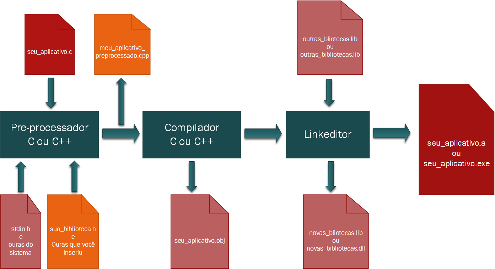

Como já discutimos o Portugol é interpretado, um programa especialmente escrito para esta linguagem pega o arquivo onde está escrito o seu código e o interpreta linha a linha (em tempo de execução), identificando erros de escrita, e procedendo na ordem que lhe é sugerida pelos comandos.

No C algo muito diferente ocorre com seu código fonte, é preciso transforma-lo na linguagem que a máquina irá entender diretamente, antes de executa-lo e para isso há pelo menos três processos básicos a ser executados

* Pré processamento
* Compilação
* Linkedição ou Ligação

Vejamos no gráfico abaixo uma representação do processamento e compilação de um código em C.



Parece complicado não é?

Na verdade é bem simples, principalmente se usar uma boa IDE, como a que sugerimos aqui, a PELLES C (sim existem melhoras, para nós esta é mais que suficiente), ao escrever seu código no arquivo principal, no caso `seu_aplicativo.c` você deve seguir a estrutura mínima proposta anteriormente, ou seja, incluir as bibliotecas que precisa (```#include```), definir suas variáveis globais, suas funções e por fim seu código principal de entrada chamado ```int main(void).``` 

Quando usa as diretivas ```#include``` e ```#define``` você está se comunicando com o pré-processador do C para que ele prepare seu arquivo incluindo os arquivo de biblioteca, seja ele o que você mesmo possa ter definido ou arquivos de terceiros, e normalmente isso se dá pelo arquivos de cabeçalhos destas bibliotecas que são identificados pelas extenções ```.h```, veja que estes arquivos somente possuem inclusão para outros arquivos de cabeçalhos e outros arquivos de definições, ambos podem ter diretivas ```#define``` que serão então processadas e substituidas gerando assim um novo arquivo fonte bem maior.

Assim, O novo arquivo fonte que será entregue ao compilador, então processado pelo pré-processador é  analisado e compilado para que se possa gerar o arquivo de objetos, este arquivo possui uma linguagem intermediaria entre o C e o código de maquina, com isso o código pode ser reorganizado para gerar novos produtos, como bibliotecas e executáveis para a máquina a que se destina o código.

E por fim o arquivo objeto é entregue ao Linkeditor que converte as referências aos objetos (como variáveis e funções) faltantes para endereços de memória, com base nos arquivos de bilioteca fornecidos, lembra os arquivos `.h` no inicio do processamento, então estes arquivos apenas definem os nomes de funções em especial que serão encontradas nos arquivos .lib, .dll ou outros arquivos .obj, e assim o linkeditor une estas referências textuais as funções e viariáveis, convertendo cada um ao seu respetivo endereço de memória.

## Próximo Passo


Veremos agora no proximo passo quais são os tipos de dados do C, como devem ser usados e seus limites. É fundamental neste capítulo compreender como os dados são armazenados na memória de seu computador e do processador, caso preciso reveja o capítulo de tipos de dados do Portugol onde isso é esclarecido.


---

Revisado: {{ file.mtime }} | Compilado: {{ gitbook.time }}