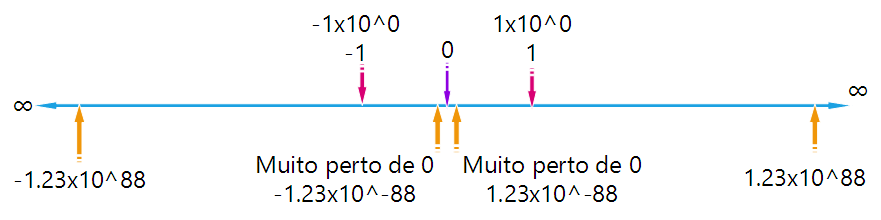

## Tipos Numéricos

A definição para tipos numéricos é bem vasta na linguagem em C, veremos alguns tipos muito importantes mas não veremos em detalhes seus limites, já que variam de plataforma para plataforma.

> **Note**
> Cada tipo de dado numérico tem seus limites tanto para números possitivos como para valores negativos, no arquivo ``stdint.h`` é possível ter acesso a constantes que nos ajudam a lidar com estes limites, no link http://www.nongnu.org/avr-libc/user-manual/group__avr__stdint.html é possível tomar conhecimento dos limites conforme a plataforma AVR. A mesma usada no Arduino UNO.

### Inteiros

Para lidar com inteiros trabalharemos apenas com um tipo, o tipo `int` que nos permite trabalhar típicamente com números de tamanho equivalentes a 16 bits, sejam positivos ou negativos, com ou sem sinal.

Para se saber o limite para números inteiros, basta elevar 2 a 16, 2 porque lidamos com dois estados 0 ou 1, e 16 por ser o limite de bits que temos sendo dois bytes. neste caso teremos o limite praa valores sem sinais, para valores com sinal basta elevar 2 a 15 já que o último bit será usado para indicar o sinal.

### Frações e ponto flutuante.

Os números fracionados e números usados em engenhária como os de ponto flutuantes, são representados especialmente no C/C++ e temos 3 tipos, porém somente veremos dois deles `float` e `double`, estes tipos são como os tipos `real` portugol.

Tais típos são padronizados pelo IEEE conforme a norma [IEEE 754](http://steve.hollasch.net/cgindex/coding/ieeefloat.html)

Veja abaixo os limites para números de ponto flutuante:



É preciso muito cuiado ao lidar com tipos com ponto flutuante, em especial em comprações, o que veremos mais afrente em operadores relacionais, quando se trata de `float`, nem sempre um 4 é realmente um 4, ele pode ser um `4.000000000000000001` isso se dá devido ao problema que se tem na forma que o número do tipo `float` é armazenado internamente, e como pode ver um `4` `float` pode não ser realmente o `4`, e se comparar sem em as operações matemáticas ou leituras com constantes, apesar de visivelmente identicos, internamente podem não ser, então muito cuidado ao lidar com tipos de dados floats e com `down casting` para outros tipos.

### Valores Lógicos

Para valores lógicos como verdadeiro e falso, temos o tipo `bool` que pode ser usado para identificar variáveis que irão guardar resultados de expressões lógicas e relacionais.

## Lidando com Arrays

No Portugol, vimos o conceito de Vetor, no C é chamado de Array, é uma forma muito especial, e deve ser usado quando precisamos lidar com uma certa coleção de dados, porém sempre do mesmo tipo exatamente como no portugol, podemos usar um array para armazena-los em memória.

Assim se tivermos 10 dados do tipo inteiro, referentes ao mesmo assunto, por exemplo 10 coordenadas no eixo `x` podemos então usar a seguinte estrutura:


```
int x[] = {20, 50, 44, 33, 21, 47, 88, 90, 20, 37};
```

Quando lidamos com o array, fazemos referência ao primeiro indice através da posição 0 (veja no portugol começavamos a contar de 1), e ao seu último indice, a posição 9 (**ou seja o seu tamanho menos 1, isso causa muitos problemas aos iniciantes, é importante ter cuidado, pois o C não irá lheproteger se tentar gravar numa posição acima do limite de seu array, podendo corromper todo seu código e causar uma pane drastica na máquina**).

Isso se faz muito válido, quando somamos o conhecimento de ponteiros com array, porque arrays são ponteiros, ou seja, ao declarar um tipo como array, estamos fazendo a mesma declaração a seguir:

```
int *xPonteiro = {20, 50, 44, 33, 21, 47, 88, 90, 20, 37};
```
Quando fazemos referência a uma posição de array, como dissemos a posição começa em `0`, portanto seria como se estivessemos somando o índice ao ponteiro.

## Tipos para Caracter e Strings

Em C não existe strings, porém no C++ temos um tipo especial de nome `string`, não o veremos aqui, mas veremos como trabalhar com strings no C puro.

Para lidar com caracteres em C, temos o tipo `char`, este tipo permite armazenar representações números dos caracteres da tabela ASCII. Ou seja valores de 0 a 255, existem outros representações de caracteres muito úteis, porém não entraremos neste tipo neste curso.

Então como lidar com strings de texto na linguagem C pura? para isso usamos um vetor terminado com o valor nulo, tal valor é presentado por \0 que na tabela ASCII é representado por `null`, assim toda string automáticamente recebe o código \0 em seu final.

Assim no código abaixo:

```
char umaString[] = "Um texto qualquer"
```

Temos um vetor de 18 posições do tipo char, sendo a ultima posição preenchida com \0.

Portanto teriamos:

| Posicão | Valor |
| --- | --- |
| umaString[0] | 'U' |
| umaString[1] | 'm' |
| umaString[2] | ' ' |
| umaString[3] | 't' |
| umaString[4] | 'e' |
| umaString[5] | 'x' |
| umaString[6] | 't' |
| umaString[7] | 'o' |
| ... | ... |
| umaString[14] | 'u' |
| umaString[15] | 'e' |
| umaString[16] | 'r' |
| umaString[4] | \0 |

Se declararmos um vector assim:

```
char umaStringGrande[400];
```

Este será capaz de armazenar uma string com até 399 caracteres, já que o último espaço do vetor deverá conter um \0 (null) para indicar o fim da string.

Veremos em momento oportuno como manipular este tipo de vetor que armazena strings, no C e C++ há cuidados muito importantes para se manipular strings, que se não forem observados, causaram mau funcionamento e até perda de dados importantes.


## Outros Tipos de Dados

Devido ao fato do C manipular a mémoria diretamente, é possível definir infinitos tipos de dados, além dos nativos da linguágem e também aqueles que são criados através de bibliotecas de manipulação, porém vermos apenas os tipos acima que são suficientes para nossos objetivos aqui.

---
Revisado: {{ file.mtime }} | Compilado: {{ gitbook.time }}
---
