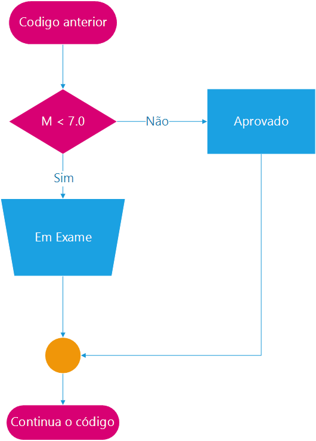
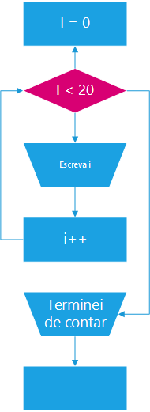
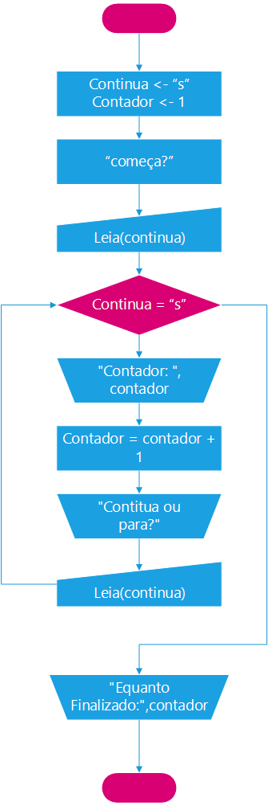

Em C temos as mesmas estruturas de controle que aprendemos no **Portugol** do **VisuAlg**. Porém apresentam uma sintaxe diferênciada além de ser no idioma inglês, ou seja "Se" passa a ser "If", "se não" passa a ser "else", 

## IF ELSE

A estrutura de controle `if` é a mesma estrutura `se` do portugol, e `else`é como `senao`em portugol, e deve ser escrita em C como apresentada abaixo:

```
if (m < 7.) 
{
  printf("Em exame");
}
else
{
  printf("Aprovado");
}
```


Veja que no C, uma estrutura de controle se asssemelha a funções, mas não são, no caso entre parenteses se encontra a operação lógica desejada.

É importante observar que os blocos de códigos escolhidos a executar nas estrutura de controle são delimitados por pares **{** e **}**.

É também importante saber, que as variáveis que forem declaradas internamente nestes blocos são vistas apenas localmente, e são recriadas sempre que os blocos são executados, portanto tenha cautela ao criar variáveis dentro de blocos de controle.

## FOR

A a operação de controle `for` é o mesmo que o `para` em portugol, tendo o formato a seguir:
 
```
for(int i = 0; i < 20; i++){
   printf("Valor= %d",i);
}
```


O comando `for` em C, pode receber até 3 parametros, separados por ponto e vírgula, o primeiro declara variáveis usadas para controle e as inicializa, o segundo é a operação lógica que define se o laço irá continuar ou não executando, conforme o resultado veradeiro ou falso, respectivamente, o terceiro parametro é como a variável de controle será alterada para que o laço continue em execução.

a Inicialização de variável pode ser feita para apenas uma variável ou mais, ou mesmo não existir, inserindo apenas o ponto virgula, neste caso deverá haver a variável externa ao laço para ser usada como referência.

O terceiro parametro onde a variável sobre interferência a cada nova interação, pode intervir somando, subtraindo ou outras formulas, porém cuidado, o ideal é apenas que o `for` seja usado como um incremento para indices de arrays.

```
int nome[] = {"um nome qualquer"};
int nomeInv[len(nome)];

for(int i = 0, int x = strlen (nome); nome[i] |= '\0' && i < strlen (nome); x--, i++){
   nomeInv[x] = nome[i];
}
printf(nomeInv);
```

### While

O laço `while` é o mesmo que `enquanto` no portugol, veja o exemplo abaixo:

```
char a = 0;
printf("Escolha uma das opções, a ou c");
while(a != 'a' && a != 'c'){
  a = getchar();
}
printf("Você escolheu uma opção %c",a);
```


O laço `while` pode também ser utilizado para que um determinado código seja executado infinitamente, isso é muito util em microcontroladores já que o código não pode nunca deixar de seer executado:

```
while(true){
// ação que deve ser executada infinitamente
```


### Do While

A estrutura `do while` permite que um laço seja executado pelo menos uma vez, então é verificado se deve executar novamente, e se verdadeiro continua até que seja a condição falsa, como podem ver o laço `do while` tem comportamento diferente ao laço `faca ate` do portugol, já que não é o inverso o raciocinio relativo ao `while` puro. Vejamos um exemplo abaixo:

```
char a = 0;
do{
  printf("Escolha uma das opções, a ou c");
  a = getchar();
}while(a != 'a' && a != 'c')
printf("Você escolheu uma opção %c",a);
```
Veja que usei o mesmo exemplo anterior aplicado no `while` e o raciocinio lógico continua o mesmo.


---

Revisado: {{ file.mtime }} | Compilado: {{ gitbook.time }}

---

Referência: http://www.cprogressivo.net/2012/12/Recebendo-letras-do-usuario--As-funcoes-scanf-getchar-getc-e-fgetc.html
